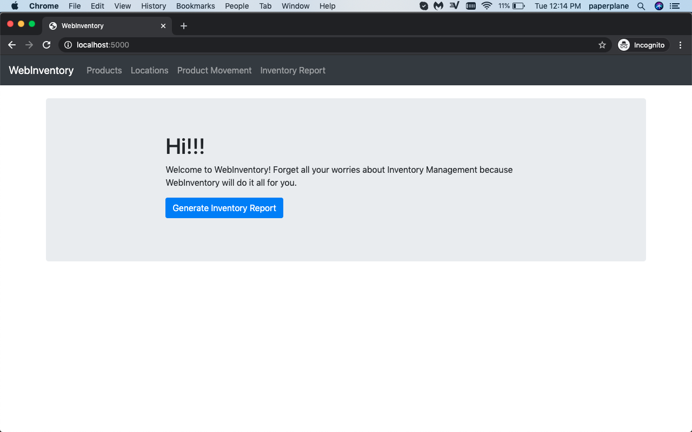
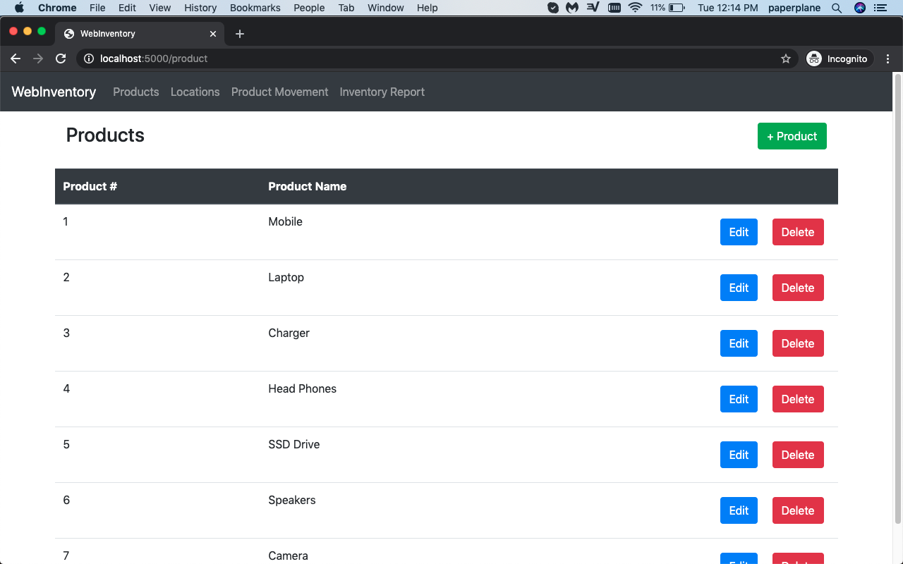
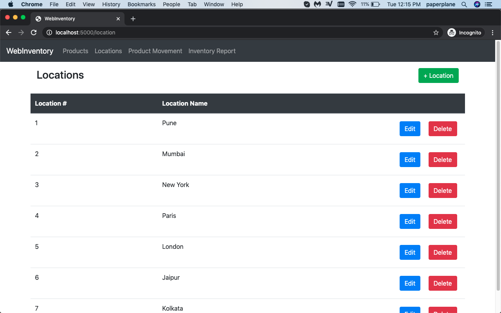
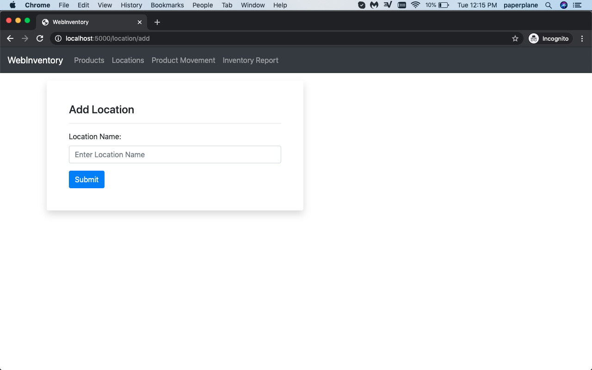
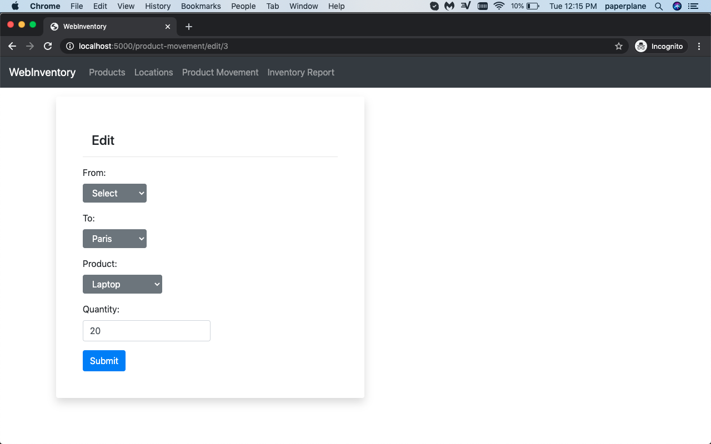
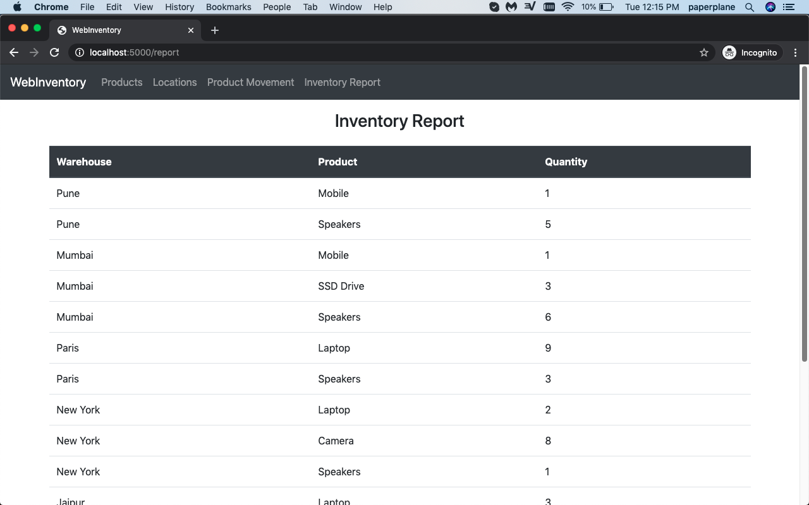

# WebInventory

#### This is a simple imventory management system

This system allows you to do the following:
1. Add, Edit, Delete Products
2. Add, Edit, Delete Inventory Locations
3. Move Products from one location to another
4. Generate an Inventory Report to verify the balance quantities in each of your warehouses

#### Home Page

#### Products

#### Locations

#### Edit Products

#### Add Locations

#### Edit Product Movements

#### Inventory Report 
